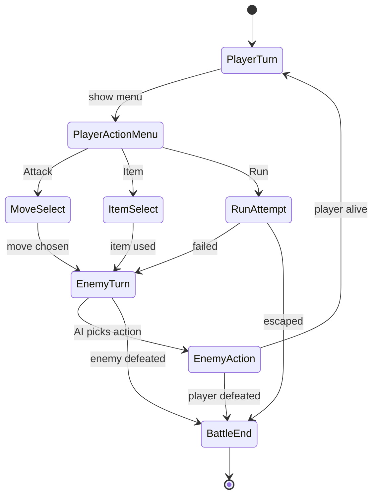
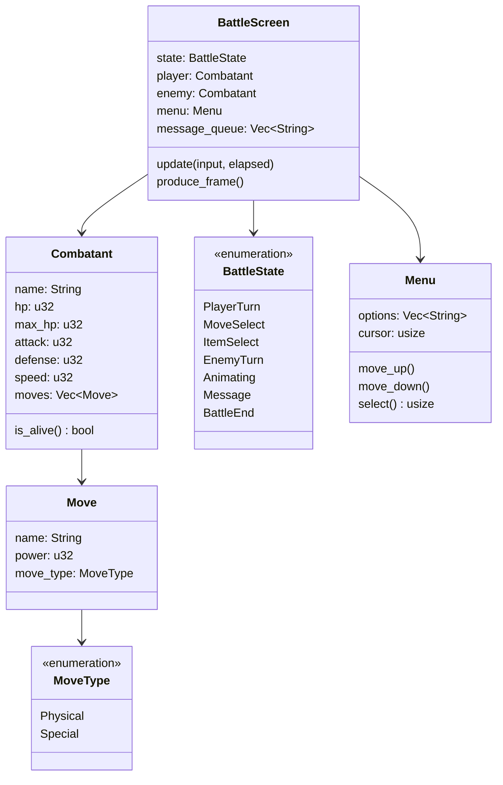
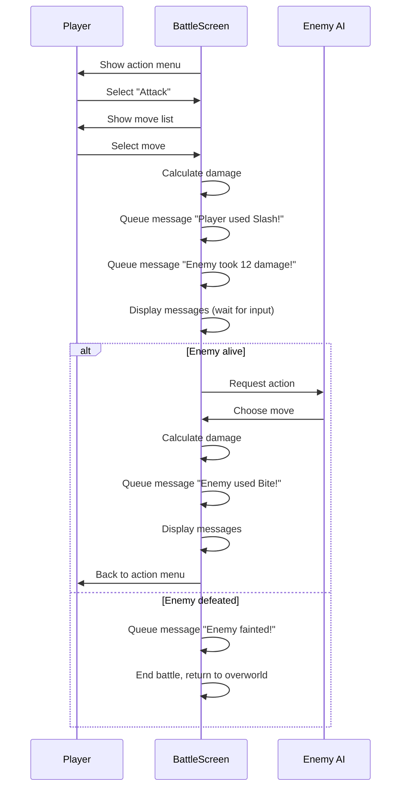
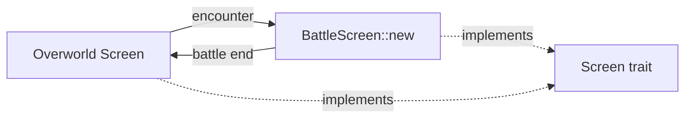

# Menu-Based Combat System

## Overview

Combat is triggered by encounters on the overworld. The game transitions to a dedicated battle screen where the player and enemies take turns selecting actions from menus.

## State Machine



## Screen Layout

```
+------------------------------------------+
|                                          |
|   Enemy Name        HP [========--]      |
|   Enemy Sprite                           |
|                                          |
|                                          |
|                                          |
|   Player Name       HP [==========]      |
|                     MP [======----]      |
|                                          |
+------------------------------------------+
|  > Attack     Item                       |
|    Defend     Run                        |
+------------------------------------------+
```

## Core Components



## Turn Flow



## Damage Formula

```
damage = ((2 * power * (attacker.attack / defender.defense)) / 5) + 2
```

A simple formula inspired by Pokemon gen 1. Can be extended later with type effectiveness, critical hits, and random variance.

## Integration with Existing Architecture



`BattleScreen` implements the existing `Screen` trait. The overworld triggers an encounter and swaps the active screen to `BattleScreen`. When combat ends, it swaps back. The `run_game` loop needs no changes — it already drives whatever `Box<dyn Screen>` is active.

## Message Queue

Rather than showing all combat results instantly, messages are queued and displayed one at a time. The player presses a key to advance to the next message. This controls pacing and makes combat readable.

States like `BattleState::Message` consume from the queue, showing one message per frame, and advance to the next state (enemy turn, player turn, or battle end) when the queue is empty.
